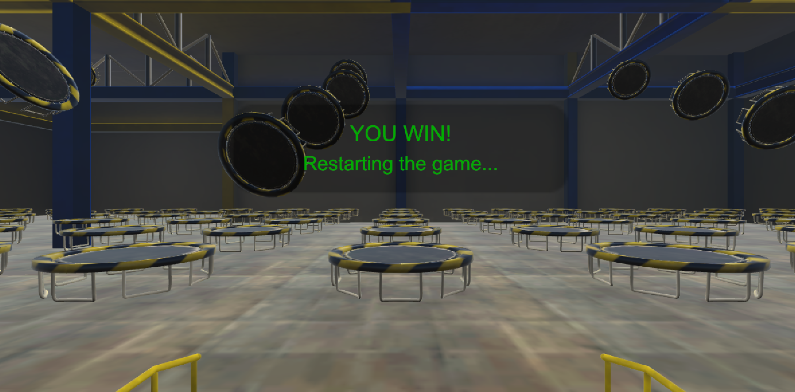

# Performance Bounceback
## Davide Zordan

Performance Bounceback project created for checking optimization skills on VR High Immersion projects. This project implements a game targeting Oculus Rift and touch controllers using the SteamVR Unity plugin.

To play, collect the balls using the controllers triggers buttons and target the trampolines to gain points!

## Getting Started

# Build and Test
It's possible to test the project using Unity. A build targeting SteamVR and Oculus Rift is available in the "OculusRiftBuild.zip" archive.

# Using Unity
Scenes required (the order should be respected):

- Assets\PerformanceBounceback\Scenes\Scene0.unity

# Steps:
- Unzip the zip file
- Launch Unity (the project is targeting Unity 2018.3.4f1)
- Open the project located under the folder “PerformanceBounceback"
- Open the scene "Scene0" to explore the hierarchy
- VR mode has been set on the Desktop build platform in the Build settings
- Launch Unity player to experience the game in the headset

# Versions Used
- [Unity 2018.3.4](https://unity3d.com/unity/whats-new/2018.3.4)
- [SteamVR Unity plugin v2.2.0](https://github.com/ValveSoftware/steamvr_unity_plugin/releases)
- [Udacity Performance Bounceback starter project](https://github.com/udacity/Performance-Bounceback-Starter-Project)